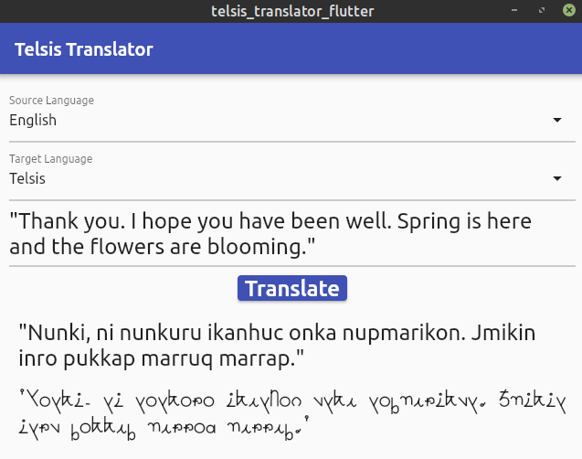

# Telsis language translator with Flutter UI

### Work in progress!!

This application is based on the [Telsis language translator](https://github.com/vivian-ng/telsis_translator) written in Python 3. It has been rewritten in Dart with a UI written in Flutter. The application translates to and from the Telsis language, the language used in the world setting of Violet Evergarden. The language is created by translating the source text into Tamil, converting the Tamil script into unaccented English alphabet characters, using a substitution cipher to swap the characters, and finally representing the results in the Telsis alphabet. The [References](#references) section contains more information about decoding the language and the original script from which the Python 3 translator was built on.

(Note: This application is my first attempt at writing something in Dart and Flutter. There are probably better ways to write some of the code, such as those dealing with Map iterations. The application has only been tested on a Linux machine and an Android phone so far. I will eventually get down to packaging it for Windows. I do not have an iPhone or Mac so it will not be possible for me to package for those platforms.)

The advantage of using Flutter for the UI is that the application can easily be built to run on many platforms. For example, this is the application running on an Android emulator. 

And the same application running natively in Linux. 

## Installation and running
[Releases](https://github.com/vivian-ng/telsis_translator_flutter/releases) are currently available for Linux (as a snap package) and Android (as APK, signed using the debug key). A build for Windows may be released in the future.

If you do not want to install the release, you can install Flutter on your system and use `flutter run` to run this application. Please follow the instructions [here](https://flutter.dev/docs/get-started/install) to install Flutter for your system. Then, clone this repository, go into the repository folder, and run `flutter run -d linux` or `flutter run -d windows` or `flutter run -d macos` depending on what system you are on. Note that this application has only been tested on Linux (Linux Mint 20.1) and an Android phone (Samsung Galaxy S7).

To install the APK, you need to enable your Android to install unknown apps. Go to Settings > Apps > Menu > Special access. Choose Install unknown apps. Then, use a file manager on your phone to navigate to wherever the APK has been downloaded, and click on the APK to install it. You can also build the APK on your own (after installing Flutter and cloning this repository) by using `flutter build apk`. Once the APK has been built, you can connect your phone to the computer and use `flutter install` to install the APK to your phone.

To install the snap package, use `sudo snap install telsis-translator-flutter_<version>.snap`. A desktop entry should be created under the Accessories category.

Once installed, the application can be run as per an app on Android or Linux.

## Usage
Either the source or target language must be specified in order for the translator to work. They must also not be the same. The application will also refuse to translate from one real world language to another real world language, so it cannot be used as a free translation app.

If Telsis is specified as the source language, the translator will attempt to translate the source text into the given target language, which defaults to English if not specified. If a source language other than Telsis is specified, the translator will attempt to translate the source text into Telsis.

If Telsis is specified as the target language, the translator will attempt to translate the source text into Telsis, guessing the source language if it is not specified. If a target language other than Telsis is specified, the translator will assume the source text is in the Telsis language and attempt to translate the source text into the given target language.

Names can be enclosed in backslashes so that they appear correctly in translated text. A backslash is also used as an escape character. If the use of backslash can result in such characters, leave a space after the backslash.

Note: Punctuation is sometimes not handled properly, so it is best to avoid using punctuation marks in the source text.

## Requirements
The UI was written in Flutter and uses the following packages: 
[flutter_form_builder](https://pub.dev/packages/flutter_form_builder) 
[diacritic](https://pub.dev/packages/diacritic) 
[http](https://pub.dev/packages/http) 
[desktop_window](https://pub.dev/packages/desktop_window) 

A modified version of [translator](https://pub.dev/packages/translator)
by [Gabriel Pacheco](https://github.com/gabrielpacheco23) is also used by the application. The package was modified to allow use of Tamil script in the conversion process.

[flutter_launcher_icons](https://pub.dev/packages/flutter_launcher_icons) was used to create the icons for Android.

## References
- Original [Python script](https://repl.it/@ValkrenDarklock/NunkishTrans) by Valkren, which translates Telsis into English
- [Reddit post](https://www.reddit.com/r/anime/comments/88bbob/violet_evergarden_alphabet_and_language_part_2/) on decoding the Telsis language

## Revision history
- 2021-04-03: Initial release (0.1.0).

## Disclaimer
This application is not for sale. It is meant for demonstration purpose only. No support is provided for this application. The rights to the Telsis language belong to the copyright holders of the Violet Evergarden anime series, and its portrayal in this application (as a font) is based on the concept of fair use. By using this application, the end user agrees to undertake full responsibility for using this application. The developer is not liable for any damage that may arise from the use of this application.

## License
MIT License; see [LICENSE](LICENSE) file for more information.

The [Telsis language font](fonts/TelsisTyped.otf) is for use with my programs and not for distribution.

Copyright (c) 2021 Vivian Ng
